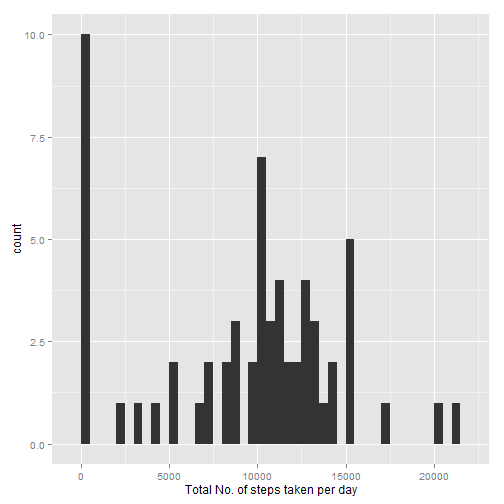
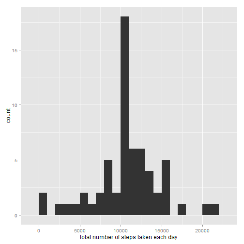

## Loading and preprocessing the data

```r
echo = TRUE
unzip(zipfile="activity.zip")
data <- read.csv("activity.csv")
summary(data)
```

```
##      steps                date          interval     
##  Min.   :  0.00   2012-10-01:  288   Min.   :   0.0  
##  1st Qu.:  0.00   2012-10-02:  288   1st Qu.: 588.8  
##  Median :  0.00   2012-10-03:  288   Median :1177.5  
##  Mean   : 37.38   2012-10-04:  288   Mean   :1177.5  
##  3rd Qu.: 12.00   2012-10-05:  288   3rd Qu.:1766.2  
##  Max.   :806.00   2012-10-06:  288   Max.   :2355.0  
##  NA's   :2304     (Other)   :15840
```


## What is mean total number of steps taken per day?

```r
library(ggplot2)
```

```
## Warning: package 'ggplot2' was built under R version 3.1.3
```

```r
tsteps <- tapply(data$steps, data$date, FUN=sum, na.rm=TRUE)
qplot(tsteps, binwidth=500,xlab="Total No. of steps taken per day")
```

 

Mean Steps taken per day is

```r
mean(tsteps,na.rm=TRUE)
```

```
## [1] 9354.23
```

Median Steps taken per day is

```r
median(tsteps,na.rm=TRUE)
```

```
## [1] 10395
```


## What is the average daily activity pattern?

```r
library(ggplot2)
avg <- aggregate(x=list(steps=data$steps), by=list(interval=data$interval),FUN=mean, na.rm=TRUE)
ggplot(data=avg, aes(x=interval, y=steps)) +
    geom_line() +
    xlab("5-minute interval") +
    ylab("average number of steps taken")
```

 

Which 5-minute interval, on average across all the days in the dataset, contains the maximum number of steps?

```r
avg[which.max(avg$steps),]
```

```
##     interval    steps
## 104      835 206.1698
```

## Imputing missing values

```r
missing <- is.na(data$steps)
# Table of missing values
table(missing)
```

```
## missing
## FALSE  TRUE 
## 15264  2304
```
All of the missing values are filled in with mean value for that 5-minute interval.

```r
# Replace each missing value with the mean value of its 5-minute interval
fillvalue <- function(steps, interval) {
    filled <- NA
    if (!is.na(steps))
        filled <- c(steps)
    else
        filled <- (avg[avg$interval==interval, "steps"])
    return(filled)
}
filled.data <- data
filled.data$steps <- mapply(fillvalue, filled.data$steps, filled.data$interval)
summary(filled.data)
```

```
##      steps                date          interval     
##  Min.   :  0.00   2012-10-01:  288   Min.   :   0.0  
##  1st Qu.:  0.00   2012-10-02:  288   1st Qu.: 588.8  
##  Median :  0.00   2012-10-03:  288   Median :1177.5  
##  Mean   : 37.38   2012-10-04:  288   Mean   :1177.5  
##  3rd Qu.: 27.00   2012-10-05:  288   3rd Qu.:1766.2  
##  Max.   :806.00   2012-10-06:  288   Max.   :2355.0  
##                   (Other)   :15840
```

Now, using the filled data set, let's make a histogram of the total number of steps taken each day and calculate the mean and median total number of steps.


```r
totalsteps <- tapply(filled.data$steps, filled.data$date, FUN=sum)
qplot(totalsteps, binwidth=1000, xlab="total number of steps taken each day")
```

 

```r
mean(totalsteps)
```

```
## [1] 10766.19
```

```r
median(totalsteps)
```

```
## [1] 10766.19
```

Mean and median values are higher after imputing missing data.
Reasons
* Original Data :- Some "steps" values are 'NA' which are treated as 0 by default.
  After Processing:- "steps" now does not have 'NA'; so all values are chosen.
  This has resulted in higher values for mean, median.

* Histogram does not have any 0 values, now.

## Are there differences in activity patterns between weekdays and weekends?

```r
weekfunc <- function(date) {
    day <- weekdays(date)
    if (day %in% c("Saturday", "Sunday"))
        return("weekend")
    else if (day %in% c("Monday", "Tuesday", "Wednesday", "Thursday", "Friday"))
        return("weekday")
    else
        stop("invalid date")
}

filled.data$date <- as.Date(filled.data$date)
filled.data$day <- sapply(filled.data$date, FUN=weekfunc)
```

Now, let's make a panel plot containing plots of average number of steps taken
on weekdays and weekends.

```r
avgfilled <- aggregate(steps ~ interval + day, data=filled.data, mean)
ggplot(avgfilled, aes(interval, steps)) + geom_line() + facet_grid(day ~ .) +
    xlab("5-minute interval") + ylab("Number of steps")
```

 


End of Document
